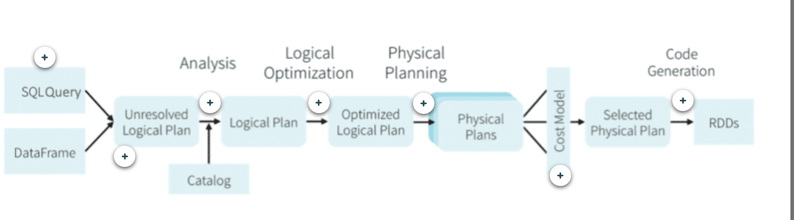

##### Spark Processing

+ Spark uses clusters of machines to process big data by breaking a large task into smaller ones and distributing the work among several machines. Let’s look at how spark executes a spark application.

+ The secret to Spark’s performances is parallelism. 
  + Each parallelized action is referred to as a job. 
  + Each job is broken down into stages. Each job is broken down into stages, which is a set of ordered steps that, together, accomplish a job.
  + Tasks are created by the driver and assigned a partition of data to process. These are the smallest unit of work.

##### Spark Cluster

**Driver** :Driver is where the application runs and has 3 main functions
 1. maintaining information about spark application
 2. responding to user program
 3. analyzing, distributing and scheduling work accross executors.

**Executor** : holds a chunck of data to be processed. A chunk is called **Partitions**. Its a chunk of rows that sit on one machine in cluster. It is responsible for 2 functions.
 1. execute the code assiged by driver.
 2. report the state of computation back to the driver.

**Tasks** :

**Core/Slots** : 

##### Transformations and Actions

##### Catalyst Optimizer

##### What is a dataframe?
Distributed collection of data grouped into named columns
**Schema** defines the column names and types
**Transformations** are methods that return a new DataFrame and are lazily evaluated. Select, where, and orderBy are examples of transformations.
Because each of these return a DataFrame, we are able to chain these methods together to build new DataFrames.
**Actions** are methods that trigger computation. Count returns the number of records in a DataFrame, collect returns an array of all rows in a DataFrame, and head displays the top few rows of a DataFrame. 
**Lazy Evaluation** DataFrame transformations are not evaluated until an action is called. 

##### SparkSession
SparkSession is a reference to the spark application running on the cluster

